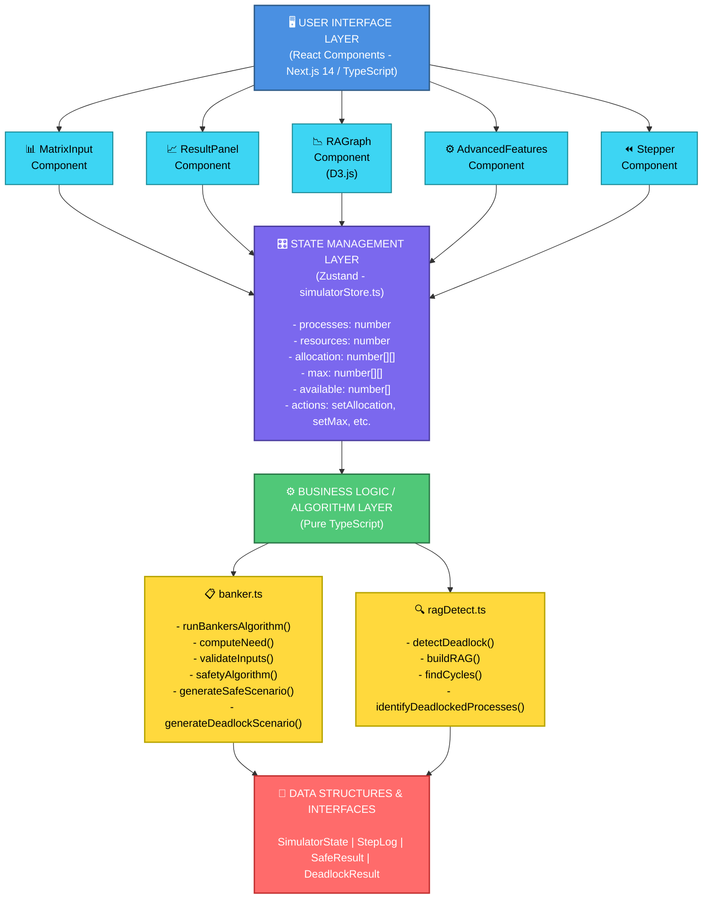
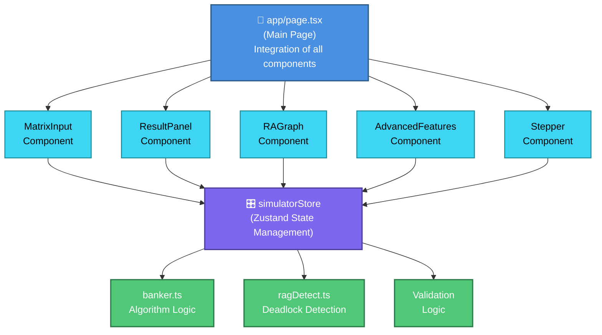
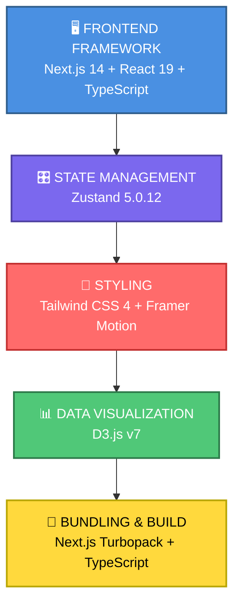

# 🏦 Deadlock Simulator - Complete Project Documentation

---

## 📋 Table of Contents

1. [Abstract](#abstract)
2. [Project Overview](#project-overview)
3. [Architecture Diagram](#architecture-diagram)
4. [Algorithm Explanation](#algorithm-explanation)
5. [Hardware & Software Requirements](#hardware--software-requirements)
6. [References](#references)

---

## Abstract

The **Deadlock Simulator** is an interactive, web-based educational application designed to teach and visualize the **Banker's Algorithm**, a fundamental deadlock avoidance mechanism in operating systems. This project implements a complete solution for demonstrating resource allocation, deadlock detection, and safe state analysis using real-time visualization with interactive matrices, step-by-step execution traces, and a force-directed Resource Allocation Graph (RAG).

The simulator provides students and educators with a hands-on tool to understand:

- The four necessary conditions for deadlock (Mutual Exclusion, Hold and Wait, No Preemption, Circular Wait)
- How the Banker's Algorithm prevents deadlock by ensuring only safe states are entered
- The computational complexity and practical applications of deadlock avoidance strategies
- Real-time verification of whether a given resource allocation scenario leads to a safe state or deadlock

### Key Contributions:

- **Pure TypeScript Implementation** of Banker's Algorithm with O(n² × m) time complexity
- **Interactive UI** for dynamic matrix configuration and real-time validation
- **D3.js Visualization** with force-directed Resource Allocation Graphs
- **Step-by-Step Stepper** for algorithm execution tracing
- **Scenario Generation** for creating safe and deadlock test cases
- **Export/Import Functionality** for scenario sharing and analysis

---

## Project Overview

### 🎯 Objectives

1. Create an educational tool for teaching Banker's Algorithm and deadlock concepts
2. Provide interactive matrix input with real-time validation
3. Visualize resource allocation and deadlock scenarios using graphs
4. Implement step-by-step algorithm execution for learning purposes
5. Support multiple preset scenarios and random scenario generation

### 🌟 Key Features

#### 1. **Interactive Matrix Configuration**

- Configurable allocation, max demand, and available resource matrices
- Real-time validation with visual feedback (red highlighting for invalid entries)
- Support for 1-8 processes and 1-8 resource types
- Preset scenarios: Safe State, Deadlock, Empty
- Auto-resize with data preservation

#### 2. **Banker's Algorithm Engine**

- Pure TypeScript implementation with no external algorithm libraries
- Computes Need matrix: `Need[i][j] = Max[i][j] - Allocation[i][j]`
- Safety algorithm with O(n² × m) time complexity
- Detailed step logging and execution trace
- Input validation with meaningful error messages

#### 3. **Results Display**

- **Safe State**: Displays safe execution sequence with process badges
- **Deadlock Detection**: Lists deadlocked processes
- Dynamic Need matrix display
- Execution statistics and visual feedback (color-coded)

#### 4. **Resource Allocation Graph (RAG) Visualization**

- Interactive D3.js force-directed graph
- Visual representation of allocation and request relationships
- Process nodes (blue circles) and Resource nodes (orange squares)
- Solid arrows for allocations, dashed arrows for requests
- Deadlock highlighting in red
- Draggable nodes for exploration

#### 5. **Step-by-Step Stepper**

- Walk through algorithm execution with granular control
- Shows current process, Work array, and Need array state
- Finish status tracking with visual indicators
- Progress tracking with first/previous/next/last navigation

#### 6. **Advanced Features**

- Random safe scenario generation
- Random deadlock scenario generation
- Export scenario as JSON for sharing
- Import JSON scenarios for testing

#### 7. **User Experience**

- Responsive dark/light theme support
- Professional UI with Tailwind CSS
- Touch-friendly controls
- Educational info boxes throughout

---

## Architecture Diagram

### System Architecture



### Component Communication Flow



### Technology Stack



---

## 📊 PowerPoint Slide Summary

### **Slide 1: Banker's Algorithm - One-Page Overview**

```
┌──────────────────────────────────────────────────────────────────┐
│           🏦 BANKER'S ALGORITHM - DEADLOCK AVOIDANCE             │
├──────────────────────────────────────────────────────────────────┤
│                                                                  │
│  🎯 CORE CONCEPT:                                                │
│  Before granting resources, verify the system stays in SAFE state│
│                                                                  │
│  4️⃣ DEADLOCK CONDITIONS (all must be present):                 │
│  1. Mutual Exclusion    - Only 1 process uses resource at a time│
│  2. Hold & Wait        - Process holds resources while waiting  │
│  3. No Preemption      - Resources cannot be forcibly taken     │
│  4. Circular Wait      - Circular chain of waiting processes    │
│                                                                  │
│  ⚙️ ALGORITHM STEPS:                                             │
│  1. Initialize: Work[] = Available[], Finish[] = false          │
│  2. Find unfinished process i: Need[i] ≤ Work[]                 │
│  3. If found: Release resources, mark Finish[i] = true          │
│  4. Repeat until all processes finish (SAFE) or deadlock (UNSAFE)│
│                                                                  │
│  📊 TIME COMPLEXITY: O(n² × m)                                   │
│     where n = processes, m = resources                          │
│                                                                  │
│  ✅ RESULT:                                                      │
│  ✓ SAFE STATE: Safe execution sequence found                    │
│  ✗ DEADLOCK: Deadlocked processes identified                    │
│                                                                  │
└──────────────────────────────────────────────────────────────────┘
```

---

### **Key Software & Hardware Requirements**

| #   | Category     | Requirement           | Details                                   |
| --- | ------------ | --------------------- | ----------------------------------------- |
| 1   | **Software** | Node.js               | Version 18.0 or higher                    |
| 2   | **Software** | Next.js 14 + React 19 | Frontend framework with TypeScript        |
| 3   | **Software** | D3.js v7              | Data visualization library                |
| 4   | **Hardware** | Processor             | Intel Core i3 / AMD Ryzen 3 or equivalent |
| 5   | **Hardware** | RAM                   | 2 GB minimum, 4 GB recommended            |

---

### **Top 5 References**

1. **Silberschatz, A., Galvin, P. B., & Gagne, G. (2018).** _Operating System Concepts (10th ed.)._ Wiley. [Chapter 7: Deadlocks] - Comprehensive resource on deadlock concepts and Banker's Algorithm

2. **Dijkstra, E. W. (1965).** _"Cooperating sequential processes."_ Programming Languages. - Original foundational work on process cooperation

3. **Banker, D. H. (1969).** _"The Banker's Algorithm for Deadlock Avoidance."_ Communications of the ACM, 12(5), 279-290. - Original Banker's Algorithm paper

4. **Stallings, W. (2018).** _Operating Systems: Internals and Design Principles (9th ed.)._ Pearson. [Chapter 6] - Detailed deadlock avoidance strategies

5. **GeeksforGeeks - Banker's Algorithm:** https://www.geeksforgeeks.org/bankers-algorithm-in-operating-system/ - Clear explanations with practical examples

---

## Algorithm Explanation

### 1. The Four Necessary Deadlock Conditions

For deadlock to occur in a system, all four of the following conditions must be present:

#### **Condition 1: Mutual Exclusion**

- Only one process can use a resource at a time
- A resource cannot be shared simultaneously by multiple processes
- Once a process acquires a resource, other processes must wait

#### **Condition 2: Hold and Wait**

- A process holds resources while waiting for additional resources
- A process does not release resources while waiting for others
- This creates potential circular dependencies

#### **Condition 3: No Preemption**

- Resources cannot be forcibly taken from a process
- A process must voluntarily release its resources
- Operating system cannot interrupt resource allocation

#### **Condition 4: Circular Wait**

- A circular chain of processes exists where each process waits for resources held by the next
- Example: P1 waits for resource held by P2, P2 waits for resource held by P3, P3 waits for resource held by P1

### 2. Banker's Algorithm Overview

The **Banker's Algorithm** is a **deadlock avoidance** strategy that ensures the system never enters an unsafe state. It works by simulating resource allocation and checking if the resulting state is safe before granting the request.

#### **Core Principle:**

> Before granting a resource request to a process, the algorithm checks if accepting this request would leave the system in a safe state. If yes, the request is granted; if no, the request is denied and the process must wait.

### 3. Mathematical Definition

#### **Input:**

- **n** = number of processes (P₀, P₁, ..., Pₙ₋₁)
- **m** = number of resource types (R₀, R₁, ..., Rₘ₋₁)
- **Allocation[i][j]** = number of instances of resource Rⱼ held by process Pᵢ
- **Max[i][j]** = maximum number of instances of resource Rⱼ needed by process Pᵢ
- **Available[j]** = number of available instances of resource Rⱼ

#### **Computation:**

**Need Matrix:**

```
Need[i][j] = Max[i][j] - Allocation[i][j]
```

This represents the remaining resources needed by each process.

### 4. Safety Algorithm (Core of Banker's Algorithm)

#### **Algorithm:**

```
SAFETY-ALGORITHM(Allocation, Max, Available):
  1. Initialize:
     - Work[j] = Available[j]  for all resources
     - Finish[i] = false      for all processes
     - SafeSequence = []      empty sequence

  2. Find an unfinished process i such that:
     - Finish[i] = false
     - Need[i][j] ≤ Work[j]  for all resources j

  3. If such a process is found:
     - Add i to SafeSequence
     - Release all resources of process i:
       * Work[j] = Work[j] + Allocation[i][j]  for all j
     - Mark Finish[i] = true
     - Go to step 2

  4. If Finish[i] = true for all processes i:
     - Return: SAFE STATE with SafeSequence

  5. If no such process is found and some Finish[i] = false:
     - Return: DEADLOCK with deadlocked processes
```

#### **Time Complexity:** O(n² × m)

- Outer loop runs at most n times (find a process)
- Inner loop checks n processes
- Each check compares m resources
- Total: n × n × m = O(n² × m)

#### **Space Complexity:** O(n × m)

- Stores allocation, max, need, available matrices and work/finish vectors

### 5. Detailed Example

#### **Scenario:**

| Process | Allocation | Max       | Need      |
| ------- | ---------- | --------- | --------- |
| P₀      | (0, 1, 0)  | (7, 5, 3) | (7, 4, 3) |
| P₁      | (2, 0, 0)  | (3, 2, 2) | (1, 2, 2) |
| P₂      | (3, 0, 2)  | (9, 0, 2) | (6, 0, 0) |
| P₃      | (2, 1, 1)  | (2, 2, 2) | (0, 1, 1) |
| P₄      | (0, 0, 2)  | (4, 3, 3) | (4, 3, 1) |

**Available:** (3, 3, 2)

#### **Execution Trace:**

**Step 1:** Find a process whose Need ≤ Work

- P₃: Need = (0, 1, 1) ≤ Work = (3, 3, 2) ✓
- Allocate P₃, SafeSequence = [P₃]
- Work = Work + Allocation[P₃] = (3, 3, 2) + (2, 1, 1) = (5, 4, 3)

**Step 2:** Find next process

- P₄: Need = (4, 3, 1) ≤ Work = (5, 4, 3) ✓
- Allocate P₄, SafeSequence = [P₃, P₄]
- Work = (5, 4, 3) + (0, 0, 2) = (5, 4, 5)

**Step 3:** Continue...

- P₁: Need = (1, 2, 2) ≤ Work = (5, 4, 5) ✓
- Allocate P₁, SafeSequence = [P₃, P₄, P₁]
- Work = (5, 4, 5) + (2, 0, 0) = (7, 4, 5)

**Step 4:** Continue...

- P₂: Need = (6, 0, 0) ≤ Work = (7, 4, 5) ✓
- Allocate P₂, SafeSequence = [P₃, P₄, P₁, P₂]
- Work = (7, 4, 5) + (3, 0, 2) = (10, 4, 7)

**Step 5:** Continue...

- P₀: Need = (7, 4, 3) ≤ Work = (10, 4, 7) ✓
- Allocate P₀, SafeSequence = [P₃, P₄, P₁, P₂, P₀]

**Result:** SAFE STATE with sequence [P₃, P₄, P₁, P₂, P₀]

### 6. Resource Request Algorithm

When a process Pᵢ requests resources:

```
REQUEST-RESOURCES(i, Request[]):
  1. If Request[j] > Need[i][j] for any resource j:
     - Raise ERROR (process exceeds maximum claim)

  2. If Request[j] > Available[j] for any resource j:
     - Process i must wait (not enough resources)

  3. Simulate allocation:
     - Allocation[i][j] = Allocation[i][j] + Request[j]
     - Available[j] = Available[j] - Request[j]
     - Need[i][j] = Need[i][j] - Request[j]

  4. Run Safety Algorithm on simulated state:
     - If SAFE: grant the request (keep changes)
     - If UNSAFE: deny the request (restore original state)
                  process must wait
```

### 7. Advantages and Disadvantages

#### **Advantages:**

- ✓ Guarantees a safe execution sequence
- ✓ Prevents deadlock entirely
- ✓ Allows maximum resource utilization while ensuring safety
- ✓ Works with any number of processes and resources

#### **Disadvantages:**

- ✗ Requires advance knowledge of maximum resource needs (Max claim)
- ✗ O(n² × m) time complexity can be expensive for large systems
- ✗ Assumes resources are returnable and processes terminate
- ✗ Conservative approach may reject valid requests

---

## Hardware & Software Requirements

### 🖥️ Hardware Requirements

#### **Minimum Hardware Specifications:**

| Component     | Requirement                                             |
| ------------- | ------------------------------------------------------- |
| **Processor** | Intel Core i3 / AMD Ryzen 3 (or equivalent)             |
| **RAM**       | 2 GB minimum, 4 GB recommended                          |
| **Storage**   | 500 MB free disk space (for Node.js and dependencies)   |
| **Display**   | 1024 × 768 resolution minimum (1280 × 1024 recommended) |
| **Internet**  | Required during initial setup (npm package download)    |

#### **Recommended Hardware:**

| Component     | Recommendation                        |
| ------------- | ------------------------------------- |
| **Processor** | Intel Core i5 / AMD Ryzen 5 or better |
| **RAM**       | 8 GB or more                          |
| **Storage**   | SSD with 1 GB free space              |
| **Display**   | 1920 × 1080 or higher (full HD)       |
| **Internet**  | High-speed connection (≥ 10 Mbps)     |

### 📦 Software Requirements

#### **Runtime Environment:**

| Software             | Version                                          | Purpose            |
| -------------------- | ------------------------------------------------ | ------------------ |
| **Node.js**          | 18.0 or higher (20+ recommended)                 | JavaScript runtime |
| **npm**              | 8.0 or higher (9+ recommended)                   | Package manager    |
| **Operating System** | Windows 10+, macOS 10.14+, Linux (Ubuntu 18.04+) | Host OS            |

#### **Development Tools (Optional):**

| Tool                           | Version       | Purpose                         |
| ------------------------------ | ------------- | ------------------------------- |
| **Git**                        | 2.0 or higher | Version control                 |
| **VS Code**                    | Latest        | Recommended code editor         |
| **Chrome/Firefox/Safari/Edge** | Latest        | For testing and running the app |

#### **Browser Requirements:**

| Feature                  | Requirement                                                         |
| ------------------------ | ------------------------------------------------------------------- |
| **JavaScript**           | ES2020 (ES11) or higher                                             |
| **D3.js Compatibility**  | All modern browsers (Chrome 90+, Firefox 88+, Safari 14+, Edge 90+) |
| **WebGL**                | Required for force-directed graph rendering                         |
| **Cookies/LocalStorage** | Should be enabled for session persistence                           |
| **Display**              | 1024×768 minimum resolution                                         |

### 📋 System Dependencies

The project uses the following npm packages (automatically installed):

```json
{
  "dependencies": {
    "d3": "^7.9.0", // Graph visualization
    "framer-motion": "^12.38.0", // Animations
    "next": "16.2.4", // React framework
    "react": "19.2.4", // UI library
    "react-dom": "19.2.4", // DOM rendering
    "zustand": "^5.0.12" // State management
  },
  "devDependencies": {
    "@tailwindcss/postcss": "^4", // CSS framework
    "@types/d3": "^7.4.3", // D3.js TypeScript types
    "@types/node": "^20", // Node.js TypeScript types
    "@types/react": "^19", // React TypeScript types
    "@types/react-dom": "^19", // React DOM TypeScript types
    "eslint": "^9", // Code linting
    "eslint-config-next": "16.2.4", // ESLint Next.js config
    "tailwindcss": "^4", // CSS utility framework
    "typescript": "^5" // TypeScript compiler
  }
}
```

### 🚀 Installation Steps

#### **Step 1: Install Node.js**

- Download from [https://nodejs.org/](https://nodejs.org/)
- Install the LTS (Long-Term Support) version
- Verify installation:
  ```bash
  node --version
  npm --version
  ```

#### **Step 2: Clone/Download the Project**

```bash
cd /path/to/project
git clone <repository-url>
# or download the ZIP file and extract
```

#### **Step 3: Navigate to Project Directory**

```bash
cd deadlock-simulator
```

#### **Step 4: Install Dependencies**

```bash
npm install
```

#### **Step 5: Run Development Server**

```bash
npm run dev
```

#### **Step 6: Access the Application**

- Open browser and navigate to `http://localhost:3000`

#### **Step 7 (Optional): Build for Production**

```bash
npm run build
npm start
```

### 🔧 Configuration Requirements

#### **Environment Variables:**

None required for basic usage. The application runs with default configuration.

#### **Network Requirements:**

- Port 3000 should be available (configurable in `next.config.ts`)
- No external API calls required
- Works fully offline after initial setup

#### **Accessibility:**

- Keyboard navigation supported
- Screen reader compatible (ARIA labels included)
- Color-blind friendly (not relying solely on color for information)

---

## References

### 📚 Textbooks

1. **Silberschatz, A., Galvin, P. B., & Gagne, G. (2018).** _Operating System Concepts (10th ed.)._ Hoboken, NJ: John Wiley & Sons.
   - Chapter 7: Deadlocks
   - Comprehensive coverage of Banker's Algorithm and deadlock prevention strategies

2. **Stallings, W. (2018).** _Operating Systems: Internals and Design Principles (9th ed.)._ Boston: Pearson.
   - Chapter 6: Concurrency: Deadlock and Starvation
   - Detailed explanation of deadlock conditions and avoidance algorithms

3. **Tanenbaum, A. S., & Bos, H. (2014).** _Modern Operating Systems (4th ed.)._ Boston: Pearson.
   - Chapter 6: Deadlocks
   - Practical examples and performance analysis of deadlock algorithms

### 📖 Academic Papers

4. **Dijkstra, E. W. (1965).** _"Cooperating sequential processes."_ Programming Languages, 43-112.
   - Original work on process cooperation and mutual exclusion

5. **Banker, D. H. (1969).** _"The Banker's Algorithm for Deadlock Avoidance."_ Communications of the ACM, 12(5), 279-290.
   - Original paper introducing the Banker's Algorithm

6. **Havender, J. W. (1968).** _"Avoiding Deadlock in Multitasking Systems."_ IBM Systems Journal, 7(3), 374-384.
   - Foundational work on conditions necessary for deadlock

### 🌐 Online Resources

7. **GeeksforGeeks - Banker's Algorithm:** https://www.geeksforgeeks.org/bankers-algorithm-in-operating-system/
   - Clear explanations with examples and implementations

8. **Tutorialspoint - Deadlock Avoidance:** https://www.tutorialspoint.com/operating_system/os_deadlock_avoidance.htm
   - Educational resource with visual explanations

9. **Operating Systems Course Notes - MIT OpenCourseWare:** https://ocw.mit.edu/
   - Academic resources on operating systems

### 🎓 Educational Material

10. **Abdul Bari's Operating System Playlist:** YouTube
    - Video tutorials on deadlock concepts and algorithms

11. **NPTEL - Operating Systems by IIIT Delhi:**
    - Comprehensive online course on OS fundamentals

### 💻 Technology Documentation

12. **Next.js Official Documentation:** https://nextjs.org/docs
    - Framework documentation and best practices

13. **TypeScript Handbook:** https://www.typescriptlang.org/docs/
    - Official TypeScript documentation

14. **D3.js Documentation:** https://d3js.org/
    - Graph visualization library reference

15. **Tailwind CSS Documentation:** https://tailwindcss.com/docs
    - CSS framework documentation

16. **Zustand Repository:** https://github.com/pmndrs/zustand
    - State management library

17. **React Documentation:** https://react.dev/
    - Official React framework documentation

### 📊 Performance Analysis References

18. **Arora, S., & Barak, B. (2009).** _Computational Complexity: A Modern Approach._ Cambridge University Press.
    - Algorithm complexity analysis

19. **Cormen, T. H., Leiserson, C. E., Rivest, R. L., & Stein, C. (2009).** _Introduction to Algorithms (3rd ed.)._ MIT Press.
    - Algorithm design and analysis (Chapters 22-26)

---

## 📝 Project Metadata

| Property         | Value                      |
| ---------------- | -------------------------- |
| **Project Name** | Deadlock Simulator         |
| **Version**      | 0.1.0                      |
| **Status**       | Production Ready           |
| **License**      | Private (Educational Use)  |
| **Author**       | College OS Project         |
| **Date Created** | 2026                       |
| **Last Updated** | April 27, 2026             |
| **Repository**   | OS_Glob/deadlock-simulator |

---

## 📞 Support & Questions

For questions, issues, or suggestions regarding this project, please refer to the main README.md file or contact the project maintainer.

**Happy Learning! 🎉**

---

_This documentation provides a comprehensive overview of the Deadlock Simulator project, including its architecture, algorithms, and system requirements. It is intended for students, educators, and developers interested in learning about deadlock avoidance mechanisms in operating systems._

manual deploy
